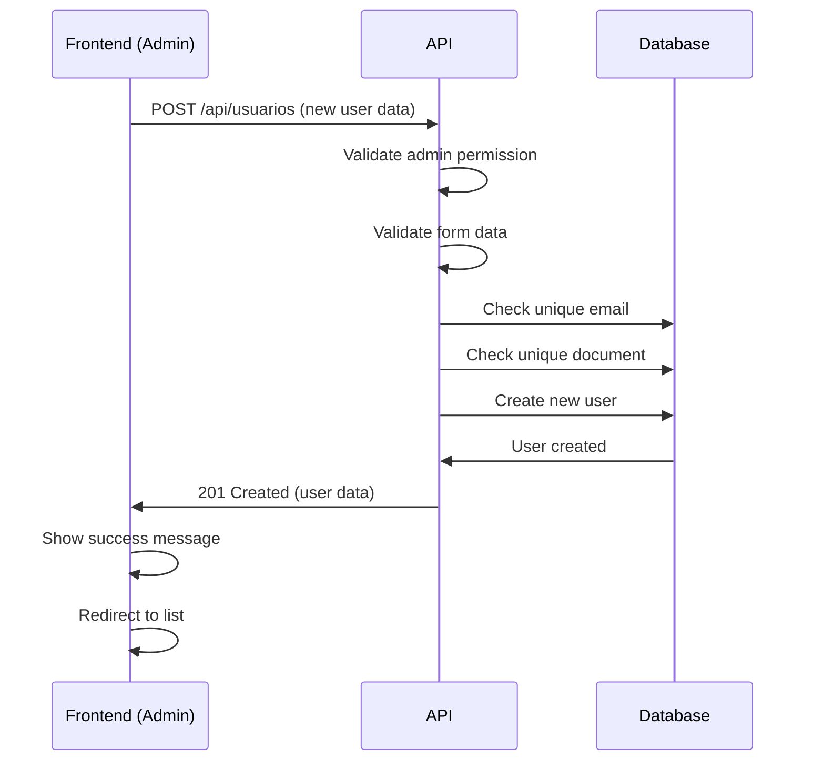

# User Management API - Administrators

## 📋 Overview

This documentation describes the API routes and functionalities for user management, **exclusive to administrators**. All routes described here require:

1. **JWT Authentication** (`Bearer Token`)
2. **Administrator Permission** (`tipo_usuario: 'administrador'`)

---

## 🔐 Authentication

All requests must include the authentication header:

```http
Authorization: Bearer {your_jwt_token}
```

### Permission Verification

The `AdminMiddleware` automatically verifies:
- If the JWT token is valid
- If the authenticated user has `tipo_usuario === 'administrador'`

**Error response (403) if not admin:**
```json
{
  "sucesso": false,
  "mensagem": "Acesso negado. Apenas administradores podem acessar este recurso."
}
```

---

## 📍 Base URL

```
{API_URL}/api/usuarios
```

> **Note:** All URLs below are relative to the base URL.

---

## 🔍 1. List Users (with Filters and Pagination)

Lists all active users in the system with support for filters and pagination.

### Request

```http
GET /api/usuarios
```

### Query Parameters (Optional)

| Parameter | Type | Description | Example |
|-----------|------|-------------|---------|
| `per_page` | integer | Number of records per page | `15` (default) |
| `page` | integer | Page number | `1` (default) |
| `tipo_usuario` | string | Filter by user type | `administrador` or `usuario` |
| `email` | string | Partial email search | `joao@email.com` |
| `nome` | string | Partial name search (first, last, or nickname) | `João Silva` |

### Request Examples

**Basic listing (page 1, 15 items):**
```bash
GET /api/usuarios
```

**Listing with 25 items per page:**
```bash
GET /api/usuarios?per_page=25
```

**Filter clients only:**
```bash
GET /api/usuarios?tipo_usuario=usuario
```

**Search by email:**
```bash
GET /api/usuarios?email=joao@email.com
```

**Search by name:**
```bash
GET /api/usuarios?nome=João
```

**Combining filters:**
```bash
GET /api/usuarios?tipo_usuario=usuario&nome=Silva&per_page=20&page=2
```

### Response (200 OK)

```json
{
  "sucesso": true,
  "dados": {
    "current_page": 1,
    "data": [
      {
        "id": "01HQXYZ1234567890ABCDEFGH",
        "primeiro_nome": "João",
        "segundo_nome": "Silva",
        "apelido": "João",
        "email": "joao.silva@email.com",
        "telefone": "(11) 98765-4321",
        "numero_documento": "123.456.789-00",
        "data_nascimento": "1990-05-15",
        "tipo_usuario": "usuario",
        "aceite_comunicacoes_email": true,
        "aceite_comunicacoes_sms": false,
        "aceite_comunicacoes_whatsapp": true,
        "ativo": true,
        "email_verified_at": "2025-01-15T10:30:00.000000Z",
        "avatar": null,
        "provider": null,
        "google_id": null,
        "created_at": "2025-01-15T10:25:00.000000Z",
        "updated_at": "2025-01-15T10:30:00.000000Z"
      },
      // ... more users
    ],
    "first_page_url": "http://localhost:8000/api/usuarios?page=1",
    "from": 1,
    "last_page": 5,
    "last_page_url": "http://localhost:8000/api/usuarios?page=5",
    "links": [
      {
        "url": null,
        "label": "&laquo; Previous",
        "active": false
      },
      {
        "url": "http://localhost:8000/api/usuarios?page=1",
        "label": "1",
        "active": true
      },
      // ... more links
    ],
    "next_page_url": "http://localhost:8000/api/usuarios?page=2",
    "path": "http://localhost:8000/api/usuarios",
    "per_page": 15,
    "prev_page_url": null,
    "to": 15,
    "total": 73
  }
}
```

### User Fields

| Field | Type | Description |
|-------|------|-------------|
| `id` | string (ULID) | Unique user identifier |
| `primeiro_nome` | string | First name |
| `segundo_nome` | string\|null | Last name (can be null) |
| `apelido` | string | Display name/nickname |
| `email` | string | Email (unique in system) |
| `telefone` | string | Contact phone |
| `numero_documento` | string | CPF or other document (unique) |
| `data_nascimento` | date | Birth date (format: YYYY-MM-DD) |
| `tipo_usuario` | string | `administrador` or `usuario` |
| `aceite_comunicacoes_email` | boolean | Accepts emails |
| `aceite_comunicacoes_sms` | boolean | Accepts SMS |
| `aceite_comunicacoes_whatsapp` | boolean | Accepts WhatsApp messages |
| `ativo` | boolean | User status (only active are listed) |
| `email_verified_at` | datetime\|null | Email verification date/time |
| `avatar` | string\|null | Avatar URL (when social login) |
| `provider` | string\|null | Authentication provider (`google`, etc) |
| `google_id` | string\|null | Google ID (if social login) |
| `created_at` | datetime | Creation date |
| `updated_at` | datetime | Last update date |

---

## 👤 2. View Specific User

Retrieves complete details of a user by ID.

### Request

```http
GET /api/usuarios/{id}
```

### Path Parameters

| Parameter | Type | Description |
|-----------|------|-------------|
| `id` | string (ULID) | User ID |

### Request Example

```bash
GET /api/usuarios/01HQXYZ1234567890ABCDEFGH
```

### Response (200 OK)

```json
{
  "sucesso": true,
  "dados": {
    "id": "01HQXYZ1234567890ABCDEFGH",
    "primeiro_nome": "João",
    "segundo_nome": "Silva",
    "apelido": "João",
    "email": "joao.silva@email.com",
    "telefone": "(11) 98765-4321",
    "numero_documento": "123.456.789-00",
    "data_nascimento": "1990-05-15",
    "tipo_usuario": "usuario",
    "aceite_comunicacoes_email": true,
    "aceite_comunicacoes_sms": false,
    "aceite_comunicacoes_whatsapp": true,
    "ativo": true,
    "email_verified_at": "2025-01-15T10:30:00.000000Z",
    "avatar": null,
    "provider": null,
    "google_id": null,
    "created_at": "2025-01-15T10:25:00.000000Z",
    "updated_at": "2025-01-15T10:30:00.000000Z"
  }
}
```

### Response (404 Not Found)

```json
{
  "sucesso": false,
  "mensagem": "Usuário não encontrado"
}
```

---

## ➕ 3. Create New User

Creates a new user in the system (administrators only).

### Request

```http
POST /api/usuarios
Content-Type: application/json
```

### Body Parameters

| Field | Type | Required | Description | Validation |
|-------|------|----------|-------------|------------|
| `primeiro_nome` | string | ✅ Yes | First name | Max. 255 characters |
| `segundo_nome` | string | ✅ Yes | Last name | Max. 255 characters |
| `apelido` | string | ✅ Yes | Display name | Max. 255 characters |
| `email` | string | ✅ Yes | Email | Valid format, unique in system |
| `senha` | string | ✅ Yes | Password | Minimum 6 characters |
| `telefone` | string | ✅ Yes | Phone | Max. 20 characters |
| `numero_documento` | string | ✅ Yes | CPF or document | Max. 20 characters, unique |
| `data_nascimento` | date | ✅ Yes | Birth date | Format: YYYY-MM-DD |
| `tipo_usuario` | string | ❌ No | User type | `administrador` or `usuario` (default: `usuario`) |
| `aceite_comunicacoes_email` | boolean | ❌ No | Email acceptance | Default: `false` |
| `aceite_comunicacoes_sms` | boolean | ❌ No | SMS acceptance | Default: `false` |
| `aceite_comunicacoes_whatsapp` | boolean | ❌ No | WhatsApp acceptance | Default: `false` |

### Request Example

```json
{
  "primeiro_nome": "Maria",
  "segundo_nome": "Santos",
  "apelido": "Maria",
  "email": "maria.santos@email.com",
  "senha": "senha123456",
  "telefone": "(11) 91234-5678",
  "numero_documento": "987.654.321-00",
  "data_nascimento": "1995-08-20",
  "tipo_usuario": "usuario",
  "aceite_comunicacoes_email": true,
  "aceite_comunicacoes_sms": false,
  "aceite_comunicacoes_whatsapp": true
}
```

### Response (201 Created)

```json
{
  "sucesso": true,
  "mensagem": "Usuário criado com sucesso",
  "dados": {
    "id": "01HQABC9876543210XYZDEFGH",
    "primeiro_nome": "Maria",
    "segundo_nome": "Santos",
    "apelido": "Maria",
    "email": "maria.santos@email.com",
    "telefone": "(11) 91234-5678",
    "numero_documento": "987.654.321-00",
    "data_nascimento": "1995-08-20",
    "tipo_usuario": "usuario",
    "aceite_comunicacoes_email": true,
    "aceite_comunicacoes_sms": false,
    "aceite_comunicacoes_whatsapp": true,
    "ativo": true,
    "email_verified_at": null,
    "created_at": "2025-01-20T15:30:00.000000Z",
    "updated_at": "2025-01-20T15:30:00.000000Z"
  }
}
```

### Response (422 Unprocessable Entity) - Validation Error

```json
{
  "sucesso": false,
  "mensagem": "Dados inválidos",
  "erros": {
    "email": [
      "Email já cadastrado"
    ],
    "senha": [
      "Senha deve ter no mínimo 6 caracteres"
    ],
    "numero_documento": [
      "Número do documento já cadastrado"
    ]
  }
}
```

---

## ✏️ 4. Update User

Updates data of an existing user (administrators only).

### Request

```http
PUT /api/usuarios/{id}
Content-Type: application/json
```

### Path Parameters

| Parameter | Type | Description |
|-----------|------|-------------|
| `id` | string (ULID) | ID of user to be updated |

### Body Parameters

> **Note:** All fields are **optional** in updates. Send only the fields you want to modify.

| Field | Type | Description | Validation |
|-------|------|-------------|------------|
| `primeiro_nome` | string | First name | Max. 255 characters |
| `segundo_nome` | string | Last name | Max. 255 characters |
| `apelido` | string | Display name | Max. 255 characters |
| `email` | string | Email | Valid format, unique (except for own user) |
| `senha` | string | New password | Minimum 6 characters |
| `telefone` | string | Phone | Max. 20 characters |
| `numero_documento` | string | CPF or document | Max. 20 characters, unique (except for own user) |
| `data_nascimento` | date | Birth date | Format: YYYY-MM-DD |
| `tipo_usuario` | string | User type | `administrador` or `usuario` |
| `aceite_comunicacoes_email` | boolean | Email acceptance | `true` or `false` |
| `aceite_comunicacoes_sms` | boolean | SMS acceptance | `true` or `false` |
| `aceite_comunicacoes_whatsapp` | boolean | WhatsApp acceptance | `true` or `false` |

### Request Examples

**Update only email and phone:**
```json
{
  "email": "novo.email@email.com",
  "telefone": "(11) 99999-8888"
}
```

**Update user type to administrator:**
```json
{
  "tipo_usuario": "administrador"
}
```

**Update multiple fields:**
```json
{
  "primeiro_nome": "João Pedro",
  "apelido": "JP",
  "telefone": "(11) 98888-7777",
  "aceite_comunicacoes_whatsapp": false
}
```

**Reset user password:**
```json
{
  "senha": "novaSenhaSegura123"
}
```

### Response (200 OK)

```json
{
  "sucesso": true,
  "mensagem": "Usuário atualizado com sucesso",
  "dados": {
    "id": "01HQXYZ1234567890ABCDEFGH",
    "primeiro_nome": "João Pedro",
    "segundo_nome": "Silva",
    "apelido": "JP",
    "email": "novo.email@email.com",
    "telefone": "(11) 98888-7777",
    "numero_documento": "123.456.789-00",
    "data_nascimento": "1990-05-15",
    "tipo_usuario": "usuario",
    "aceite_comunicacoes_email": true,
    "aceite_comunicacoes_sms": false,
    "aceite_comunicacoes_whatsapp": false,
    "ativo": true,
    "email_verified_at": "2025-01-15T10:30:00.000000Z",
    "created_at": "2025-01-15T10:25:00.000000Z",
    "updated_at": "2025-01-20T16:45:00.000000Z"
  }
}
```

### Response (404 Not Found)

```json
{
  "sucesso": false,
  "mensagem": "Usuário não encontrado"
}
```

### Response (422 Unprocessable Entity)

```json
{
  "sucesso": false,
  "mensagem": "Dados inválidos",
  "erros": {
    "email": [
      "Email já cadastrado"
    ]
  }
}
```

---

## 🗑️ 5. Remove User (Soft Delete)

Removes a user from the system (soft delete - only marks as inactive).

### Request

```http
DELETE /api/usuarios/{id}
```

### Path Parameters

| Parameter | Type | Description |
|-----------|------|-------------|
| `id` | string (ULID) | ID of user to be removed |

### Request Example

```bash
DELETE /api/usuarios/01HQXYZ1234567890ABCDEFGH
```

### Response (200 OK)

```json
{
  "sucesso": true,
  "mensagem": "Usuário removido com sucesso"
}
```

### Response (404 Not Found)

```json
{
  "sucesso": false,
  "mensagem": "Usuário não encontrado"
}
```

### ⚠️ Important about Removal

- Removal is **soft delete**: user is not deleted from database, only marked as `ativo: false`
- Inactive users **don't appear** in listings
- User **can no longer login** after removal
- Email and document of removed user **remain reserved** (cannot be reused)

---

## 🔒 Route Available for All Authenticated Users

### Change Own Password

Allows **any authenticated user** (admin or not) to change their own password.

#### Request

```http
PUT /api/usuarios/alterar-senha
Content-Type: application/json
```

#### Body Parameters

| Field | Type | Required | Description | Validation |
|-------|------|----------|-------------|------------|
| `senha_atual` | string | ✅ Yes | User's current password | - |
| `nova_senha` | string | ✅ Yes | New password | Minimum 6 characters |
| `nova_senha_confirmation` | string | ✅ Yes | New password confirmation | Must match `nova_senha` |

#### Request Example

```json
{
  "senha_atual": "minhasenhaantiga123",
  "nova_senha": "minhanovasenha456",
  "nova_senha_confirmation": "minhanovasenha456"
}
```

#### Response (200 OK)

```json
{
  "sucesso": true,
  "mensagem": "Senha alterada com sucesso"
}
```

#### Response (400 Bad Request) - Incorrect Current Password

```json
{
  "sucesso": false,
  "mensagem": "Senha atual incorreta"
}
```

#### Response (422 Unprocessable Entity) - Validation

```json
{
  "sucesso": false,
  "mensagem": "Dados inválidos",
  "erros": {
    "nova_senha": [
      "Nova senha deve ter no mínimo 6 caracteres",
      "Confirmação da senha não confere"
    ]
  }
}
```

---

## 🎯 Use Cases - Frontend Implementation

### 1️⃣ User List Screen

**Features:**
- Paginated table with all users
- Filters by: user type, email, name
- Items per page selector (10, 15, 25, 50)
- Action buttons: View, Edit, Remove
- Visual badge for user type (admin/client)
- Email verified indicator
- Real-time search (debounced)

**React implementation example:**

```javascript
// List component
const [users, setUsers] = useState([]);
const [loading, setLoading] = useState(false);
const [pagination, setPagination] = useState({
  currentPage: 1,
  perPage: 15,
  total: 0
});
const [filters, setFilters] = useState({
  tipo_usuario: '',
  email: '',
  nome: ''
});

const fetchUsers = async (page = 1) => {
  setLoading(true);
  try {
    const queryParams = new URLSearchParams({
      page,
      per_page: pagination.perPage,
      ...filters
    });
    
    const response = await api.get(`/usuarios?${queryParams}`, {
      headers: {
        'Authorization': `Bearer ${token}`
      }
    });
    
    if (response.data.sucesso) {
      setUsers(response.data.dados.data);
      setPagination({
        currentPage: response.data.dados.current_page,
        perPage: response.data.dados.per_page,
        total: response.data.dados.total,
        lastPage: response.data.dados.last_page
      });
    }
  } catch (error) {
    console.error('Error fetching users:', error);
    // Handle error (show toast/notification)
  } finally {
    setLoading(false);
  }
};

useEffect(() => {
  fetchUsers();
}, [filters, pagination.perPage]);
```

### 2️⃣ User View Screen

**Features:**
- Display all user data in readonly format
- Edit button
- Visual indicators for communication preferences
- Status badges (active/inactive, email verified)

### 3️⃣ User Creation Screen

**Features:**
- Complete form with validation
- Required fields clearly indicated
- Mask for CPF and phone
- User type selector
- Checkboxes for communication preferences
- Visual feedback for validation errors

**Frontend validations:**
- First name: required, max 255 characters
- Last name: required, max 255 characters
- Email: required, valid format
- Password: required, minimum 6 characters
- Phone: required, valid format
- CPF: required, valid format
- Birth date: required, valid date, minimum age

### 4️⃣ User Edit Screen

**Features:**
- Pre-filled form with current data
- All fields editable (except ID)
- Optional password field (empty = don't change)
- Option to promote/demote between admin and user
- Confirmation before saving critical changes
- Visual feedback for changed fields

**Implementation example:**

```javascript
const [formData, setFormData] = useState({
  primeiro_nome: '',
  segundo_nome: '',
  apelido: '',
  email: '',
  telefone: '',
  numero_documento: '',
  data_nascimento: '',
  tipo_usuario: 'usuario',
  // ... other fields
});

const handleUpdate = async (userId) => {
  try {
    const response = await api.put(`/usuarios/${userId}`, formData, {
      headers: {
        'Authorization': `Bearer ${token}`,
        'Content-Type': 'application/json'
      }
    });
    
    if (response.data.sucesso) {
      // Success - show message and redirect
      toast.success('User updated successfully!');
      navigate('/admin/usuarios');
    }
  } catch (error) {
    if (error.response?.status === 422) {
      // Validation errors
      const erros = error.response.data.erros;
      // Show errors in form
    } else {
      toast.error('Error updating user');
    }
  }
};
```

### 5️⃣ Remove Confirmation Modal

**Features:**
- Confirmation modal with user information
- Alert about removal consequences
- Cancel and confirm buttons
- Loading state during operation

```javascript
const handleDelete = async (userId, userName) => {
  const confirmed = await showConfirmDialog({
    title: 'Remove User',
    message: `Are you sure you want to remove user "${userName}"? This action will mark the user as inactive and they won't be able to access the system anymore.`,
    confirmText: 'Yes, remove',
    cancelText: 'Cancel',
    type: 'danger'
  });
  
  if (confirmed) {
    try {
      const response = await api.delete(`/usuarios/${userId}`, {
        headers: {
          'Authorization': `Bearer ${token}`
        }
      });
      
      if (response.data.sucesso) {
        toast.success('User removed successfully!');
        fetchUsers(); // Reload list
      }
    } catch (error) {
      toast.error('Error removing user');
    }
  }
};
```

---

## 🛡️ Error Handling

### HTTP Status Codes

| Code | Meaning | When It Occurs |
|------|---------|----------------|
| `200` | OK | Successful operation (GET, PUT, DELETE) |
| `201` | Created | User created successfully |
| `400` | Bad Request | Invalid data or business logic violated |
| `401` | Unauthorized | Invalid or expired token |
| `403` | Forbidden | User doesn't have admin permission |
| `404` | Not Found | User not found |
| `422` | Unprocessable Entity | Validation errors |
| `500` | Internal Server Error | Server error |

### Error Response Structure

```json
{
  "sucesso": false,
  "mensagem": "Error description",
  "erros": {
    "field": [
      "Specific error message"
    ]
  }
}
```

### Handling Recommendations

1. **401 Unauthorized**: Redirect to login
2. **403 Forbidden**: Show "Access denied" message and redirect
3. **422 Validation**: Show errors on specific form fields
4. **500 Server Error**: Show generic message and try again

---

## 📊 Complete Flow Example

### Flow: Admin creates new client user



---

## 🔄 Versioning

**Current version:** 1.0.0  
**Last update:** October 24, 2025

---

## 📝 Important Notes

### ⚠️ Security

1. **Never store passwords in plain text** - API already hashes automatically
2. **JWT token must be stored securely** (httpOnly cookies or localStorage with care)
3. **Always validate permissions in frontend** before showing admin options
4. **Implement rate limiting** to prevent brute force attacks

### 💡 Best Practices

1. **Use debounce** on search fields to avoid many requests
2. **Implement loading states** in all async operations
3. **Cache user list** when appropriate
4. **Show visual feedback** for all actions (toast, snackbar, etc)
5. **Implement infinite scroll** or "load more" for better UX
6. **Validate data in frontend** before sending to API

### 🎨 UX/UI Suggestions

1. **Responsive table** with horizontal scroll on mobile
2. **Collapsible filters** to save space
3. **Skeleton loaders** while loading data
4. **Empty states** when there are no users
5. **Colored badges** for user types and status
6. **Intuitive icons** for actions (edit, remove, view)
7. **Confirmation on destructive actions** (remove user)
8. **Breadcrumbs** for clear navigation

---

## 🆘 Support

For questions or problems with the API, contact the development team.

**Logs available at:**
- `storage/logs/laravel.log`

**Log prefixes:**
- `UsuarioController::` for controller logs
- `UsuarioService::` for service logs

---

## 📚 Additional Resources

- [Complete API Documentation](./README.md)
- [Authentication Guide](./authentication.md)
- [Project Structure](./concepts/README.md)

---

**© 2025 Pharmedice - Customer Area API**
